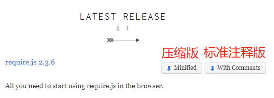
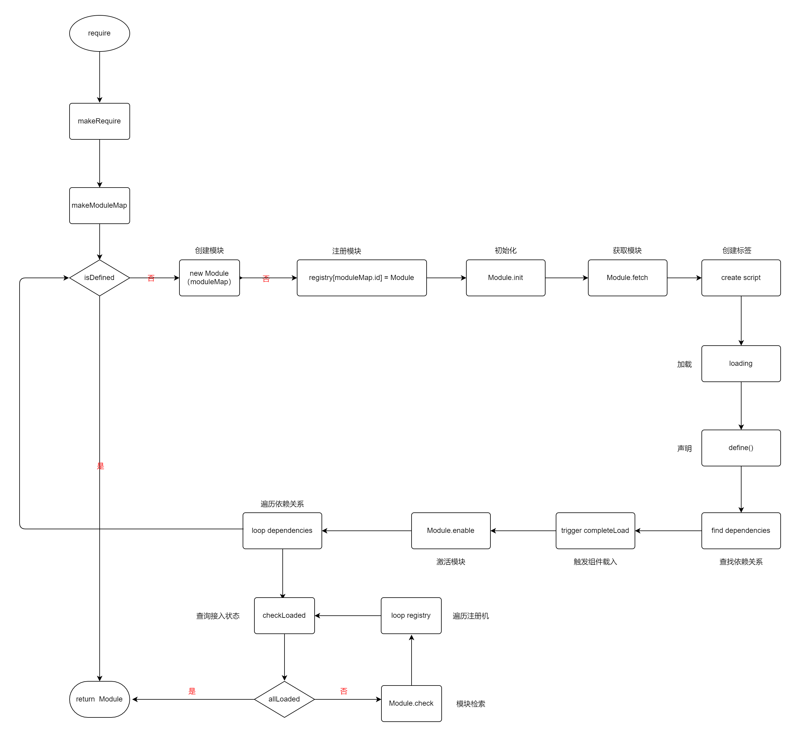

# 浅谈RequireJs

## 简介

RequireJS是一个工具库，主要用于客户端的模块管理。它可以让客户端的代码分成一个个模块，实现异步或动态加载，从而提高代码的性能和可维护性。它的模块管理遵守AMD规范（Asynchronous Module Definition异步模块定义）。

RequireJS的基本思想是，通过define方法，将代码定义为模块；通过require方法，实现代码的模块加载。

**requireJS主要解决两个问题**

- 多个js文件可能有依赖关系，被依赖的文件需要早于依赖它的文件加载到浏览器
- js加载的时候浏览器会停止页面渲染，加载文件越多，页面失去响应时间越长

## 使用

RequireJs官网 http://requirejs.org/；



在代码中引入，以main.js为例（script标签指定==**data-main**==属性时，js会默认的将data-main指定的js为根路径）

```
<script type="text/javascript" src="scripts/require.js" data-main="scripts/main.js"></script>
```


**大致流程图**

event queue > require.js >main.js > module.js > callbac



**主要用到的方法**

checkLoaded

